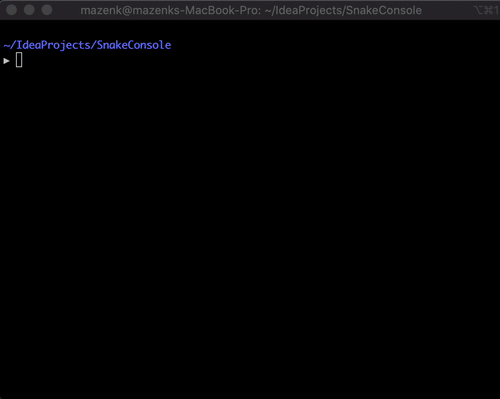

# Snake Console

I often noticed that Terminal GUI applications were written in languages like Python, C, or Go, and almost never in Java.
I usually attributed it to the JVM not having the appropriate APIs exposed, and implementing a terminal GUI application to be
a pain since you would have to go through native code. 

Out of curiosity, I did some research and found [Lanterna](https://github.com/mabe02/lanterna). I was surprised that it was
written 100% in Java and I wanted to see it for myself. This is the result of that exploration, a smooth snake game as a proof
of concept that you can build fancy terminal applications in Java.

 